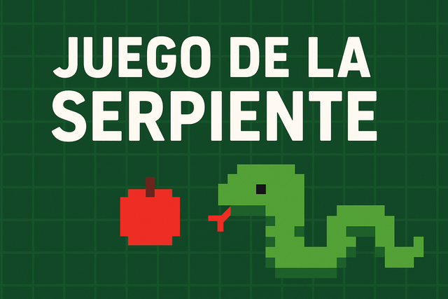
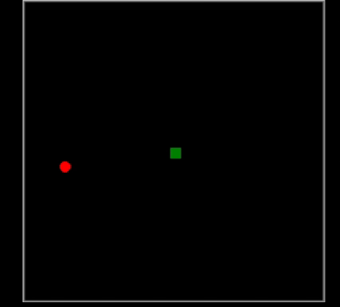

# Juego de la Serpiente

### Proyecto realizado de manera guiada con el profesorado de Implantación de Sistemas Operativos durante mis estudios en 1º Administración de Sistemas Informáticos en Red

>Proyecto en desarrollo

  

###  Objetivo
---

El objetivo principal de este proyecto es <b>aplicar los conocimientos adquiridos en clase</b> mientras gamificamos nuestro progreso

###  Tecnologías Utilizadas
---

###  Qué he aprendido al desarrollar este juego
---
- **Conceptos básicos de Python:** Arrays, variables, condicionales, funciones...
- **Uso de módulos:** Cómo funcionan y consultar la información de cada módulo
- **Aplicar lógica de programación:** Entender el funcionamiento de los objetos que se ha creado para programar el comportamiento de la serpiente
- **Interactuar con el Hardware:** Recibir la información del jugador para controlar la serpiente

###  ¿Qué ocurrira en el futuro?
---
En el futuro ampliaré mis conocimientos actualizando este proyecto, añadiendo nuevas funcionalidades. Proximamente aplicaré mis conocimientos de Python en ciberseguridad  
